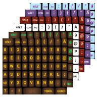

<h1>Kirja billentyűzet</h1>
 

Egy magyar nyelvű, ingyenes, nyílt forráskódú billentyűzet app Android rendszerre, amely kényelmes gépelést tesz lehetővé a magyar anyanyelvű felhasználóknak (Az összes magyar nyelvben folyószövegíráshoz használatos karakter egy nézetben, egy gombnyomásra elérhető. A program kinézete ötféle téma között változtatható gombnyomásra.

<h1>Kirja Keyboard</h1>

Kirja Keyboard is a free and open source, hungarian keyboard app for Android system. 